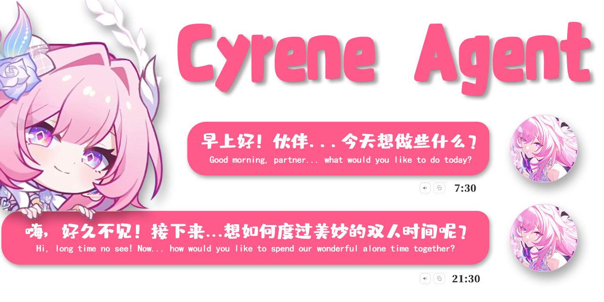

<div align="center">



# Cyrene-Agent

[English](./README.en.md) | **中文**

</div>

**Cyrene-Agent 是一个 Windows 桌面 Live2D AI 伴侣，支持聊天、记忆、语音、工具调用和多平台接入。**

> 基于 Electron + TypeScript 开发的桌面端 Live2D 智能对话 Agent，
> 搭载《崩坏：星穹铁道》昔涟（Cyrene）人设，支持日常聊天、情感交互
> 与个性化记忆引擎。

---

## ✨ 速览

- 🪟 **Live2D 桌宠** — 置顶陪伴，情感同步
- 💬 **AI 对话** — 多会话历史，人格风格切换
- 💼 **Work 模式** — Router→Plan→ActionGate 完整 Agent 工作流
- 🧠 **记忆引擎** — L0/L1/L2 + 自研 DMAE Worldbook
- 🔊 **语音通话** — TTS + ASR，解放双手
- 🖥️ **屏幕监控** — VLM 分析屏幕活动，主动消息智能判断是否打扰
- 🛠 **工具生态** — 文档生成、联网搜索、文件操作
- 📱 **多平台接入** — 飞书、微信 iLink
- 🌙 **主动聊天** — 路由可控 + 多渠道投递

---

## 🚀 快速开始

### 前置条件
- 从源码构建需要 **Node.js 24 LTS**（`npm install` / `npm run build` 依赖此版本）
- npm 10+（推荐 11）
- Windows 10/11（飞书 / 微信 / nut-js 键鼠自动化依赖 Win32 API）

### 首次使用 Checklist

```
☐ 克隆仓库
☐ npm install
☐ ⭐ 下载 BGE-M3（完整体验必需）
☐ npm run build
☐ npm start
```

> [!IMPORTANT]
>
> Cyrene 可以直接聊天。
>
> 但如果你希望获得完整体验（贴纸语义匹配、场景语义增强等），
> **强烈推荐安装 BGE-M3 Embedding 模型**。

### 1. 克隆仓库

```bash
git clone https://github.com/Playa-0v0/Cyrene-Agent.git
cd Cyrene-Agent
```

### 2. 安装依赖

```bash
npm install
```

首次安装会下载 Electron 二进制（约 100 MB）与 Pixi.js / Live2D 等渲染依赖，
耗时 3–10 分钟，取决于网络。

### 3. 安装本地模型（强烈推荐）

```
⭐⭐⭐⭐⭐ 强烈推荐：BGE-M3

作用：
✓ 贴纸语义匹配
✓ 场景语气注入
✓ Worldbook 语义增强

下载：https://github.com/Playa-0v0/Cyrene-Agent/releases
```

### 4. 构建并启动

```bash
npm run build
npm start
```

或者直接开发模式：

```bash
npm run dev
```

同时运行 `tsc`（主进程 / preload）+ `vite` + Electron，主进程改动自动
重启 Electron，渲染层改动 Vite HMR 热更新。

---

## 🔑 配置 API Key

应用启动后，**点系统托盘图标 → 打开设置**，完成以下基础配置：

1. **🔑 API 设置**：选 LLM 厂商 preset（OpenAI / Anthropic / MiniMax / ...），
   填写 API Key（**必填**，Agent 才能工作）。
2. **🎙️ TTS 设置**：选语音合成引擎（默认 MiniMax，或 GPT-SoVITS /
   自定义云端 / MiMo）。
3. **🎧 ASR 设置**：如需语音通话，可配置阿里云实时 ASR，或选择本地 Qwen / Paraformer 方案。本地方案首次使用前运行 `powershell -ExecutionPolicy Bypass -File scripts/setup-local-asr.ps1`。
4. **📱 连接手机**（可选）：要接入飞书 / 微信 iLink 时配置。

配置保存在 `<userData>/settings.json`，无需重启应用。

---

## ❓ 常见问题

### 本地 AI 模型

**Cyrene 默认无需本地模型即可聊天。**

为了获得完整体验，强烈推荐安装：

```
⭐⭐⭐⭐⭐ 强烈推荐

BGE-M3

作用：
✓ 贴纸语义匹配
✓ Scene Embedding（场景语气注入）
✓ Worldbook 语义增强

下载：https://github.com/Playa-0v0/Cyrene-Agent/releases
```

可选模型：

```
⭐⭐ 可选

ms-marco-MiniLM-L-6-v2（Reranker，轻量排序）
bge-reranker-base（Reranker，标准排序）
```

未安装这些模型不会影响聊天，只会自动关闭对应增强功能。

### 首次启动打不开 / 黑屏 / 没桌宠怎么办？

桌宠窗口**强依赖**打包内的 Live2D 模型文件。如果 `dist/renderer/public/models/cyrene/` 下的 `Cyrene.model3.json` / `model.moc3` / `texture_0.png` 任一缺失，桌宠会显示为透明白窗口（你看到的"黑屏"）。

排查步骤：
1. **看 DevTools 报错** —— dev 模式（`npm run dev`）会自动打开开发者工具，生产模式可手动按 `Ctrl+Shift+I`（Windows/Linux）或 `Cmd+Option+I`（macOS）。
2. **关注控制台错误** —— 通常会看到 `[Cyrene] Failed to load model: ...`，说明 `/models/cyrene/Cyrene.model3.json` 资源没加载到。
3. **重新构建** —— `npm run clean && npm run build && npm start` 重新生成 dist。
4. **检查 Vite 复制** —— `dist/renderer/public/models/cyrene/` 下的文件大小应与 `src/renderer/public/models/cyrene/` 一致。

### 不用 ASR 能用语音通话吗？

**不能。** 语音通话需要启用阿里云或本地 ASR（无麦克风权限 = 无法进入 LISTENING 状态；ASR 未配置 = 直接进 ERROR）。

call 窗口**没有文本输入框**或 PTT（Push-To-Talk）按钮，所有对话完全走麦克风 → ASR → LLM → TTS 的链路。如果你想纯文本聊天，**用聊天窗口**即可（不需要 ASR）。

### API Key 安全吗？

**⚠️ 简短结论：目前不建议在共享电脑或不可信环境运行。**

**聊天/视觉模型 API Key、ASR 阿里云凭证、TTS 引擎 Key 等都明文存盘**到 `<userData>/`：

- `<userData>/model-settings.json` —— LLM / Vision API Key
- `<userData>/app-settings.json` —— ASR / TTS / 高德 / 搜索 / 邮件密码
- `<userData>/weixin/credentials.json` —— 微信 iLink Bot 凭据

**唯一加密的字段**：飞书渠道的 `appSecret`（用 `safeStorage` = Windows DPAPI / macOS Keychain / Linux libsecret；无密钥环时回退 XOR 混淆）。

**防护依赖**：操作系统文件权限（`<userData>` 默认只有当前用户可读）。

**⚠️ 不要把 settings 目录打包分享、也不要同步到云盘** —— API Key 会泄露。如需重置，删除 `<userData>/model-settings.json` 和 `<userData>/app-settings.json` 后重启即可。

### macOS / Linux 能不能跑？

**理论上可以启动，但未完整验证**。已知平台假设：

| 平台 | 状态 | 备注 |
|---|---|---|
| Windows 10/11 | ✅ 完整测试 | 主要目标平台 |
| macOS | 🧡 理论上可跑 | Electron 跨平台，但桌宠透明 + 鼠标穿透在 macOS 上有 Z-order 已知问题 |
| Linux | 🧡 理论上可跑 | `safeStorage` 在 headless 环境下不可用，会回退到 XOR 混淆 |

`game-bot` 模块的 `nut.js` 是原生模块，三平台都有预编译的二进制（`package-lock.json` 里 darwin/linux/win32 三种 `libnut` 子包），但**仅在 Windows 上做了端到端测试**。

如果你在 macOS/Linux 上跑出兼容性问题，欢迎开 issue 反馈。

### 出现 OOM / 内存泄漏怎么办？

**当前没有内置内存监控 / heap dump 工具**。如果遇到 OOM，最常见的优化路径：

1. **关闭 Reranker** —— 设置 → 🧠 记忆 → Reranker 模式设为 `none`，省 23–279 MB。
2. **关闭 MCP 工具** —— 设置 → 🔌 插件，关闭 `Playwright MCP`，避免 Chromium 子进程吃几百 MB。
3. **清理 RAG 文档** —— 设置 → 🧠 记忆 → 导入文档，删除大文件（embedding 后会驻留在向量索引里）。
4. **重启应用** —— L2 长期记忆、relationship log、conflict log 都是 push 数组，无 cap，长时间运行后**重启是必要的**。

**已知改进**：embedding 索引已迁移到后台 worker 批处理并加缓存；启动时延迟预热；
批写与流式输出取代了原先一次性大数组写入，**单次文档索引入驻内存峰值明显下降**。
如遇到持续 OOM，多半与 L2 长期记忆或第三方 MCP 进程（如 Playwright / 浏览器自动化）有关。

如果 OOM 频繁，**用 Chrome DevTools Memory profiler**（dev 模式自动开 DevTools）抓 heap snapshot 找根因，再开 issue 反馈。

---

## 📊 当前状态

| 模块 | 状态 |
| --- | --- |
| 🪟 桌宠 / 多窗口 / 表情互动 | ✅ 可用 |
| 💬 日常聊天 / 语音通话 / 多会话历史 / 贴纸 | ✅ 可用 |
| 💼 Work 模式（Router→Plan→ActionGate） | ✅ 可用 |
| 🖥️ 屏幕监控（VLM 分析 + proactive 注入） | 🧪 实验性 |
| 💬 社交上下文（对话连续性缓存） | 🧪 实验性 |
| 🧠 记忆系统（L0/L1/L2 + 自研 DMAE Worldbook 引擎） | ✅ 可用 |
| 🔊 TTS / ASR / 文档生成 / 联网搜索 / 文件操作 | ✅ 可用（部分需配置） |
| 📱 飞书 Lark 长连接 | 🧪 实验性 |
| 📱 微信 iLink Bot | 🧪 实验性 |
| 🤖 Game Bot 游戏自动化 | 🧪 实验性 |
| 🔌 MCP（Model Context Protocol）生态 | 🧪 实验性 |
| ✨ Skill 系统 | ✅ 可用 |
| 📚 RAG 文档知识库（含混合检索 / reranker） | 🧪 实验性 |

> ✅ 可用：日常使用体验稳定；🧪 实验性：功能已实现但边角 / 兼容性 / 用户体验仍在打磨。

---

## ✨ 功能

### 核心功能

#### 🪟 桌面伴侣
- **Live2D 桌宠** — 基于 `pixi-live2d-display` + Cubism 引擎的置顶桌宠，
  表情切换、嘴型同步、点击交互，自然待机动画。
- **多窗口架构** — 7 个独立 BrowserWindow：聊天、侧栏、任务、设置、
  贴纸管理、通话、桌宠本体。
- **AG-UI 表情广播** — Agent 调 `play_live2d_action` 工具把「表情 +
  动作 + 气泡」推到桌宠，随对话情绪同步表演。

#### 💬 对话
- **日常聊天 + 语音通话** — 桌面 / 手机 / 通话三种人格风格切换，
  状态机 `IDLE → LISTENING → THINKING → SPEAKING → ENDED`，
  24 轮滑动窗口上下文。
- **通话记录 UI** — 通话结束后在聊天窗口显示通话气泡（时长+时间），
  点击展开梗概，可删除，不参与 LLM 上下文。
- **社交上下文** — short_term（14天TTL）/open_loop（72小时TTL）两类原子，
  embedding+lexical+recency 混合检索，对话连续性缓存。
- **多会话历史** — 每会话独立 JSON 持久化，自动派生标题、`updatedAt`
  排序，双击重命名。
- **AG-UI 事件流** — 标准化事件（RUN_STARTED / TEXT_MESSAGE / TOOL_CALL /
  RUN_FINISHED），逐字 delta 流式渲染。
- **拖拽文件摄入** — 拖入 PDF/MD/DOCX/XLSX... 直接进 RAG 知识库。
- **贴纸面板** — 内置贴纸选择器，AI 按相似度自动匹配最合适的贴纸。
- **回复分段与气泡流式** — 「聊天」偏好可设「所有 / 仅聊天 / 关闭」分段模式；
  启用时回复按句自动拆气泡，长回复不一次性刷到底。

#### 🧠 记忆系统
- **L0 核心画像 / L1 近期状态 / L2 长期记忆** — 完整证据链，
  权重自动衰减（60/30/10 阈值 active/aging/archived）。
- **冲突检测与解决** — 词法候选 → RAG 召回 → 评分 → resolver，
  解决类型覆盖无关/语境差异/偏好演变/直接冲突。
- **🧬 自研 DMAE Worldbook 引擎** — 词条格式（触发词/常驻/优先级/
  内在价值/连带触发词），`Ru = Bu × (1 + γ·ln(1+U_old))` 激活公式，
  Active / Dormant / Archived 三态状态机，One-Shot 连带触发。

#### 🔊 语音
- **多 TTS 引擎** — MiniMax / GPT-SoVITS / 自定义云端 / MiMo / off。
- **多 ASR 引擎** — 阿里云实时语音识别，以及 Qwen3-ASR-1.7B、Paraformer streaming + Qwen3-ASR-1.7B、Qwen3-ASR-0.6B 三种本地方案；支持独立热词表。阿里云 token 自动获取 + JSON 协议 +
  纯 PCM。
- **VAD 静默检测** — 通话期间检测用户停顿自动触发回复。

#### 🛠 工具调用
- **文档生成** — Excel (`exceljs`)、Word (`docx`)、PDF (`pdfkit`)、
  Markdown。
- **联网搜索 / 网页抓取** — `web_search` + `fetch_url`（turndown 转 Markdown）。
- **文件操作** — `read_file` / `list_dir` / `write_file` / `read_image`。
- **生活小工具** — 记账、汇率、翻译、行程规划、unified diff 应用。
- **任务委派** — `delegate_task`（sub-agent）、`todo_write`（任务清单）、
  `ask_user_choice`（用户选择卡片）。
- **屏幕观察** — `get_screen_observation` 工具让 LLM 按需截图并用视觉模型
  分析用户屏幕活动，30 秒缓存复用，敏感信息模糊化。

<details>
<summary><b>🧩 高级功能</b>（点击展开）</summary>

#### 📚 RAG 文档知识库
- 支持 txt/md/pdf/docx/xlsx/pptx/csv/json 多格式导入，`source: imported_doc` 可追溯。
- 混合检索：向量 + BM25 + reranker（light / standard / none 三档）。
- 双 embedding 后端：本地 `@xenova/transformers` + 云端 OpenAI 兼容。
- 实体关系图谱，jieba 词典注入防止"昔涟/小鹿"等被错误切分。

#### 🔌 MCP（Model Context Protocol）
- 支持 stdio / SSE / HTTP 三种 transport。
- 内置 servers 自动同步，`install_mcp_server` 工具让 Agent 自动装新 server。
- 自带 Playwright MCP 配置。

#### 📱 外部渠道
- **飞书 Lark 长连接** — 官方 SDK + WebSocket（无需公网 / 域名 / 内网穿透），
  p2p 私聊，多模态 text / image / audio / video / file / sticker。
- **微信 iLink Bot** — 文本收发基于 iLink HTTP / long-poll 35s 拉取；
  出站支持图片 / 表情包 / 文件 / 视频经 ilink media 上传，silk 语音编码通路。
  入站自动按媒体类型分类：图像 / 文件下载到桌面收件夹，语音用 ASR 转写，
  不支持的类型会被拦截。

#### 🤖 Game Bot 游戏自动化
- `engine.ts` 步骤解释器：`launch / wait / key / click / vlm_click /
  vlm_select / vlm_check / branch` 等指令。
- 配合 GameRecipe 格式描述自动化流程，VLM 视觉定位 + nut-js 键鼠输入。
- 暴露为 `game_bot_start` 工具，可被 Agent 调用。

#### ✨ Skill 系统
- 双源扫描：`prompts/skills/` 内置 + `<userData>/skills/` 用户覆盖，
  目录级整体覆盖。
- Meta 工具 `invoke_skill` / `read_skill_reference`，路径穿越防护 + 读
  重放拦截 + 大文本截断。
- 支持 `/skill_id ...` slash 命令。

#### 🌙 主动聊天
- **渠道化投递** —— 偏好设置可选「本地 / 微信 / 飞书」作为主动消息目的地；手机渠道不可用时取消发送，不会改投本地。
- **运行时护栏** —— hard safety policy、guarded prompt、tool-free model runner、proactive session singleton 多层兜底。
- **不打搅时段** —— 深夜无操作 / 正常聊天中 / 连续两次未回复不会触发。
- **屏幕活动注入** —— 若启用屏幕监控，proactive 发起前注入最近屏幕观察摘要，让 LLM 判断用户是否在忙，决定是否打扰。

#### 💼 Work 模式
- **内嵌视图** —— Work/Code/Learn 三模式内嵌在 Chat 窗口（模式下拉切换），
  与聊天管线双轨并行、互不合并；会话按模式过滤、懒创建，Code/Learn 目录绑定可随时补。
- **Router→Plan→ActionGate** —— 任务路由→计划生成→动作门控，完整 Agent 工作流。
- **独立记忆** —— Work memory 与主聊天 memory 完全隔离，不交叉污染。
- **工具过滤** —— 排除 recall_history / user_memory / delegate_task / ask_user_choice，
  只保留执行类工具。

#### 🖥️ 屏幕监控
- **后台状态机** —— 全速每 3 分钟截图+VLM 分析（结构化输出类型类目+连续性自判+一句概括）；两级低变化判定（主：工作/学习/日常/娱乐类型类目等值比较；次：VLM 对照上次观测自判延续/切换），低变化自动降频为每 8 分钟确认一次但不停转，检测到变化即恢复全速。
- **观测缓存** —— 进程内最多 50 条观测，2 小时保留，不存图片只存文本摘要。
- **隐私保护** —— prompt 要求 VLM 模糊化敏感信息（账号/密码/证件号），默认关闭，需配置视觉模型。

</details>

<details>
<summary><b>🔧 开发功能</b>（点击展开）</summary>

#### 🧪 单元测试
- Vitest 4 覆盖 asr / tts / channels / chats / game-bot / memory /
  opener / orchestrator / rag / scheduler / skills 等核心模块。
- `npm test` 一次性 / `npm run test:watch` 监听模式。

#### 🎬 场景模拟
- `npm run sim` 默认场景 / `sim:coffee` / `sim:mix` / `sim:rescue` 单场景调试。
- `npm run sim:sweep --rewardGain=3,5,7,10` 跑 Worldbook 评分参数 sweep。
- 产物输出到 `sim-result/`。

#### 🔧 开发者体验
- 统一 IPC 总线：`shared/ipc-channels.ts` 定义 90+ 通道常量。
- 运行时状态 preview：设置面板实时预览情绪 / 状态文案。
- Embedding 模型热切换：自动检测维度不匹配并清空旧库。
- 文件监视 / 热更新：`watchWorldbookFile` 等运行时热加载。

</details>

---

## 🧱 技术栈

| 层 | 技术 |
|---|---|
| Shell | Electron 43 |
| 渲染层 | Vite 5 + TypeScript 5 + Pixi.js 7 |
| Live2D | `pixi-live2d-display` 0.5.0-beta + Cubism Core |
| AI / MCP | `@modelcontextprotocol/sdk`, `@ag-ui/core`, `@ag-ui/client` |
| 集成 | 飞书 OpenAPI、微信 iLink、Nodemailer、PDFKit、docx |
| 测试 | Vitest 4 |

---

## 📦 项目结构

```
models/                # 本地 AI 模型（用户放置，见 docs/local-models.md）
├── Xenova/
│   ├── bge-m3/       # Embedding 模型（贴纸语义 + 场景识别，~570MB）
│   │   ├── tokenizer.json
│   │   ├── config.json
│   │   └── onnx/model_quantized.onnx
│   └── all-MiniLM-L6-v2/  # 轻量 Embedding（~23MB，可选）
├── bge-reranker-base/  # 标准排序模型（~279MB，可选）
└── ms-marco-MiniLM-L-6-v2/  # 轻量排序模型（~23MB，可选）

src/
├── main/             # Electron 主进程
│   ├── asr/          # 语音识别（阿里云 + 本地 ASR sidecar）
│   ├── call/         # 语音通话核心逻辑
│   ├── channels/     # 外部渠道适配层（飞书 / 微信 iLink / ...）
│   ├── chats/        # 多会话历史与持久化
│   ├── embedding-manager.ts  # 本地 embedding 模型生命周期
│   ├── game-bot/     # 游戏自动化（game-recipes 驱动）
│   ├── memory/       # L0/L1/L2 记忆引擎
│   ├── opener/       # 启动器 / 托盘 / 单实例
│   ├── orchestrator/ # Agent 主循环 + 工具调度
│   ├── rag/          # 检索增强生成 + worldbook 注入
│   ├── relationship/ # 用户关系画像
│   ├── scheduler/    # 定时任务（提醒 / 日程）
│   ├── screen-monitor/ # 屏幕监控（截图+VLM分析+状态机）
│   ├── sim/          # 场景模拟工具
│   ├── skills/       # Agent skill 系统
│   ├── sticker-*.ts  # 贴纸语义匹配（协议 / 存储 / 描述 / embedder）
│   ├── tts/          # 语音合成（多引擎）
│   └── work/         # Work 模式（Router→Plan→ActionGate）
├── preload/          # Electron preload 桥接
├── renderer/         # Vite 渲染层
│   ├── call/         # 语音通话窗口
│   ├── chat/         # 主聊天界面
│   ├── live2d/       # Live2D 模型渲染逻辑
│   ├── public/       # 静态资源（音频 / 头像 / Cubism Core / 贴纸）
│   ├── settings/     # 设置中心
│   ├── sidebar/      # 侧边栏
│   ├── sticker-manager/ # 贴纸管理
│   ├── tasks/        # 任务面板
│   ├── types/        # 共享类型定义
│   └── ui/           # 通用 UI 组件
└── shared/           # 主进程与渲染进程共享代码

dist/renderer/        # Vite 构建产物（不在 git 跟踪范围内）
├── assets/           # 打包后的 JS/CSS
├── audio/            # 音频资源
├── avatars/          # 头像图片
├── call/ chat/ settings/ sidebar/ sticker-manager/ tasks/   # HTML 入口
├── models/cyrene/    # Live2D 模型 — 见 MODEL_LICENSE.md
└── stickers/         # 贴纸图片资源
```

> **注意**：`dist/renderer/assets/`、`dist/renderer/*/index.html` 等
> Vite 构建产物不在 git 跟踪范围内。运行 `npm run build:renderer`
> 重新生成。

---

## ⚠️ 免责声明

本项目为**非官方粉丝同人作品**，与 HoYoverse / 米哈游**无任何关联、
背书或赞助关系**。

《崩坏：星穹铁道》、"昔涟"角色及其相关美术，世界观、商标等知识产权
归 **HoYoverse / 米哈游**所有。

**关于授权范围的说明**：

- **源代码**采用 [MIT License](./LICENSE)，仅约束本仓库的源代码。
- **角色 IP、Live2D 模型、美术资产** 不属于 MIT 授权范围，分别遵循
  [MODEL_LICENSE.md](./MODEL_LICENSE.md) 与米哈游同人创作规范处理。
- 因底层角色 IP 涉及米哈游同人创作规范，**本项目及其衍生物严禁任何
  商业用途**（售卖、付费社群、含广告变现、打包销售等）。

---

## 📄 许可证

本仓库的**源代码**遵循 [MIT License](./LICENSE)，Copyright (c) 2026 Playa。
MIT 仅约束本仓库的源代码，不适用于角色、Live2D 模型与美术资产。

角色 IP（《崩坏：星穹铁道》"昔涟" 等）、Live2D 模型（`models/cyrene/`）、
美术资产遵循各自对应的授权：

- **Live2D 模型** — 详见 [MODEL_LICENSE.md](./MODEL_LICENSE.md)，
  模型作者 [@是依七哒](https://space.bilibili.com/457683484) 授权使用、
  修改，再分发。
- **角色 IP / 美术** — 归 **HoYoverse / 米哈游**所有。

---

## 🙏 致谢

- **昔涟角色**：© HoYoverse / 米哈游
- **Live2D 模型**：由 [@是依七哒](https://space.bilibili.com/457683484) 制作 —
  详见 [MODEL_LICENSE.md](./MODEL_LICENSE.md)
- **Live2D Cubism SDK**：© Live2D Cubism

特别感谢模型原作者慷慨授权本项目使用、修改并再分发其作品。

---

## 💌 联系

欢迎通过 GitHub Issues / PR 交流。请保持讨论的礼貌与主题相关性。

---

⭐ 如果你喜欢这个项目，欢迎点一个 Star。这会帮助更多喜欢昔涟的人发现它。
